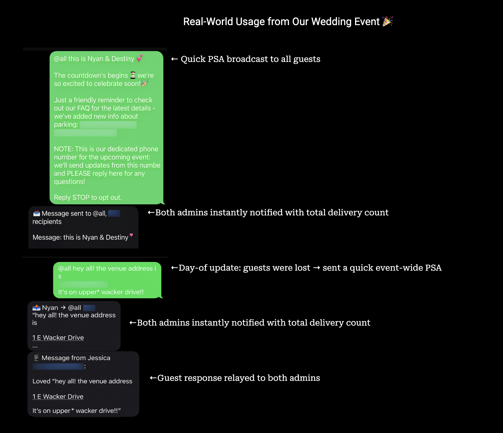

# Event SMS Relay

As we planned our wedding celebration in Chicago, guest communication quickly became chaotic. Questions about schedules, logistics, and details were coming in nonstop, and it was adding more stress to the process than it should have - especially for my wife.

Naturally, I decided to build a solution.

I created a dedicated phone number using Twilio and connected it to a serverless function. It reads incoming texts, checks a Google Sheet to determine who should receive updates, and allows us to send messages to all guests or specific groups using simple tags like "@all" or "@friends." Each message is delivered individually, so it feels personal rather than like a group blast.

When a guest replies, we both get notified right away. And if either of us responds to someone directly, the other gets an alert so we're always on the same page.

The result? A simple, text-based communication system without juggling group chats. And most importantly, a much happier wife 🤍



## Features
- 📊 Google Sheets integration — manage and update guest list easily, even during the event
- 🎯 Targeted broadcasts — send individualized texts to guest groups using aliases (e.g. @all, @friends, or @+phonenumber for direct messages)
- 🔁 Two-way messaging — guest replies are forwarded to admins, and the other admin is notified when a response is sent
- 🛑 Automatic STOP handling — compliance with SMS opt-out regulations

## **What You’ll Need**

To run this project, you’ll need accounts for the following services:

| Service | Purpose | Cost | Sign-up |
|----------|----------|------|---------|
| **AWS** | Host the serverless function (Lambda + IAM credentials) | Free tier available | [aws.amazon.com](https://aws.amazon.com) |
| **Google Cloud** | Create a Service Account for Google Sheets API access | Free | [console.cloud.google.com](https://console.cloud.google.com) |
| **Google Sheets** | Store and manage your guest list | Free | [docs.google.com/spreadsheets](https://docs.google.com/spreadsheets) |
| **Twilio** | Send and receive text messages (requires phone number + A2P registration for US) | ~$15–25/month | [twilio.com/try-twilio](https://twilio.com/try-twilio) |
| **Local Setup** | Node.js **20+**, AWS CLI, SAM CLI | Free | See setup below |

💰 **Estimated monthly cost:** ~$15–25 (Twilio phone number, A2P campaign, and per-message fees)  
🚨 **Tip:** For US numbers, start **A2P 10DLC registration** at least *1–2 weeks* before your event.

## Quick Start

> First-time setup takes about ~60 minutes. Follow these steps in order.

- [ ] **Install tools (10 min)** — Install Node.js 20+, AWS CLI, and AWS SAM CLI  
- [ ] **Set up AWS (10 min)** — Create an account, configure IAM user, and verify access  
- [ ] **Set up Google Cloud (15 min)** — Create a project, enable Sheets API, and create a service account  
- [ ] **Set up Twilio (10 min)** — Create an account, buy an SMS-capable phone number, and get your credentials  
- [ ] **Register A2P 10DLC (US only, ~1–2 weeks)** — Complete registration before production messaging   (🚨 Important!)
- [ ] **Create configuration file (5 min)** — Add credentials and settings to `parameters.json`  
- [ ] **Deploy to AWS** — Run `./deploy.sh` to create Lambda and API Gateway  
- [ ] **Configure Twilio webhook** — Point your Twilio number to your deployed API URL  
- [ ] **Test** — Send `@all Test message` from your admin phone and confirm guest delivery

Already deployed? Jump to [SMS Command Interface](#sms-command-interface).

## SMS Command Interface

### 🎯 Targeting

Prefix your message with a group tag:

| Command | Who it targets | Example |
|---|---|---|
| `@all` | All SMS-enabled guests | `@all Welcome to our wedding weekend!` |
| `@rsvped` | RSVP accepted | `@rsvped Reminder: ceremony starts at 4pm` |
| `@notresponded` | RSVP pending | `@notresponded Please RSVP by Friday` |
| `@declined` | RSVP declined | `@declined Thanks for letting us know` |
| `@family1`, `@family2` | Family subgroups | `@family1 Family dinner at 6pm` |
| `@friends` | Friends group | `@friends After-party at the hotel bar!` |

### 🔁 Replies & Opt-Out

- **Replies:** Any guest response is forwarded to all admin phones  
- **STOP:** Guest is unsubscribed (`shouldReceiveSMS` will be set to `FALSE` in Google Sheets)

## Google Sheets Configuration

### Required Columns (case-sensitive)

| Column | Type | Description | Example |
|---|---|---|---|
| `firstName` | Text | Guest’s first name | `John` |
| `lastName` | Text | Guest’s last name | `Doe` |
| `phoneNumber` | Text | E.164 format | `+1234567890` |
| `rsvpStatus` | Text | RSVP status | `accept`, `decline`, `pending` |
| `family1` | Boolean/Text | Family group | `TRUE/FALSE` |
| `family2` | Boolean/Text | Family group | `TRUE/FALSE` |
| `friends` | Boolean/Text | Friends group | `TRUE/FALSE` |
| `shouldReceiveSMS` | Boolean/Text | Opt-in flag | `TRUE/FALSE` |
| `isAdmin` | Boolean/Text | Admin Flag | `TRUE/FALSE` |

**Example Sheet**

```
firstName | lastName | phoneNumber | shouldReceiveSMS | rsvpStatus | family1 | friends | party
John      | Doe      | +1234567890 | TRUE             | accept     | TRUE    | FALSE   | friends
Sarah     | Smith    | +1987654321 | TRUE             | pending    | FALSE   | TRUE    | family2
Michael   | Johnson  | +1555666777 | FALSE            | decline    | FALSE   | FALSE   | family1
```
